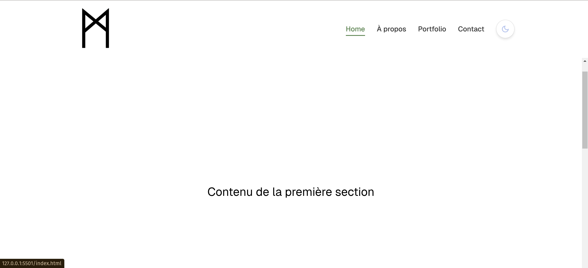
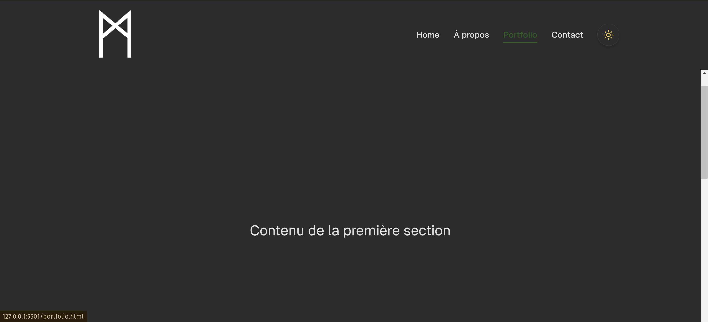

# Porrtfolio V1


This is the first version of my personal portfolio website. It showcases my skills, projects, and allows visitors to contact me directly.


## Features

- **Responsive Design:** Fully adaptable layout for all screen sizes.
- **Dark Mode:** Toggle between light and dark themes, with persistent settings using `localStorage`.
- **Scroll Animations:** Smooth animations using the Intersection Observer API.
- **Contact Form:** A simple form to send messages (currently front-end only).


## Screenshots

### Homepage


### Dark Mode



## Technologies Used

- **HTML5:** Semantic structure for web content.
- **CSS3:** Custom styling with variables and animations.
- **JavaScript:** DOM manipulation and API usage.
- **Font Awesome:** Icons for enhanced UI/UX.
- **Google Fonts:** Custom typography with the "Geist" font family.


## Getting Started

To run the project locally, follow these steps:

1. Clone the repository:
   ```bash
   git clone git@github.com:YourUsername/portfolioV1.git
   ```
2. Navigate to the project directory:
   ```bash
   cd portfolioV1
   ```
3. Open `index.html` in your browser to view the project.


## Future Improvements

- **Backend Integration:** Add a server-side script to handle form submissions.
- **Additional Sections:** Include "About Me" and "My Skills" pages.
- **Dynamic Projects Display:** Populate the portfolio dynamically using JavaScript or a database.


## Credits

- Designed and developed by [MedyVI](https://github.com/MedyVI).
- Icons by [Font Awesome](https://fontawesome.com).
- Fonts by [Google Fonts](https://fonts.google.com).


